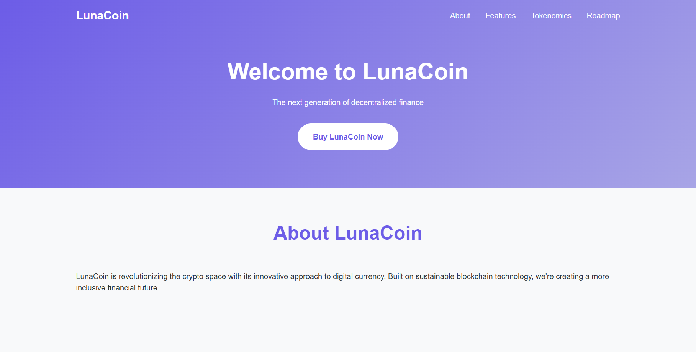
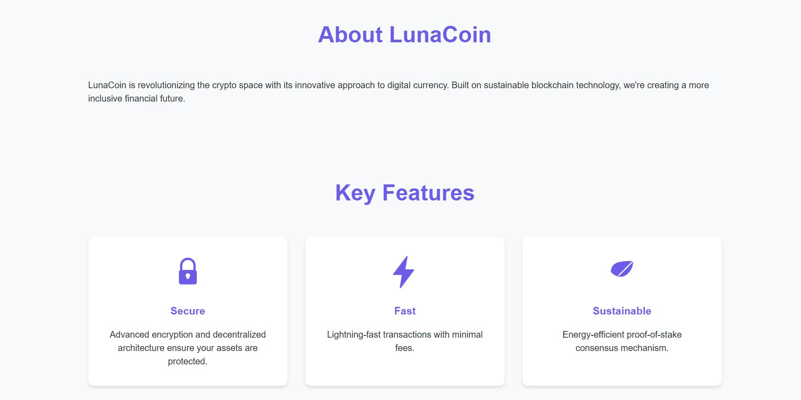
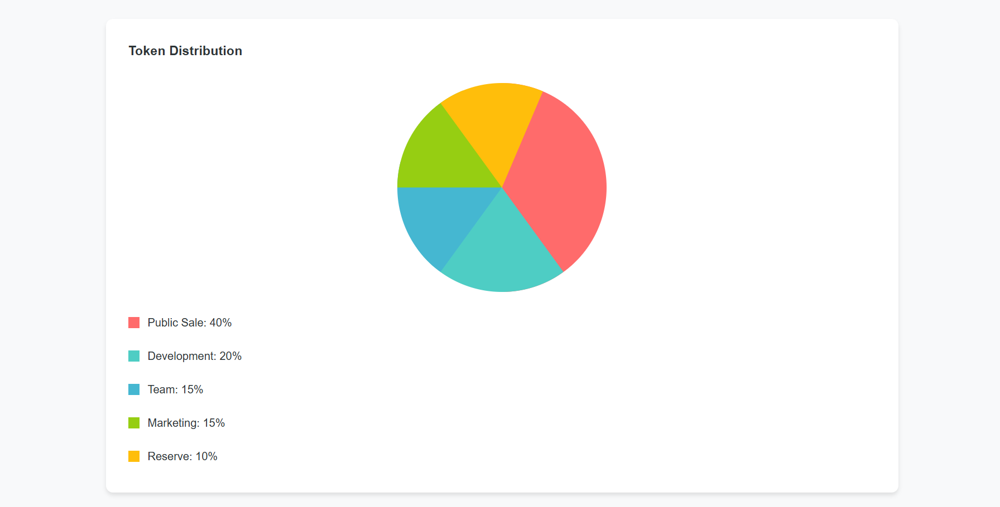

# LunaCoin Landing Page

A modern, responsive landing page for LunaCoin - a fictional cryptocurrency token. This project was created as part of Lab 2 assignment focusing on vanilla HTML and CSS implementation.

## Features

- Responsive design that works on desktop and mobile devices
- Smooth scroll navigation
- Modern gradient design
- Sections including:
  - Hero section with call-to-action
  - About
  - Key Features
  - Tokenomics
  - Roadmap

## Screenshots

## Live Demo

https://parquett.github.io/tum-web-lab2/

## Development

This project uses:
- HTML5
- CSS3
- No frameworks or libraries

To run locally:
1. Clone this repository
2. Open `index.html` in your browser

## Deployment

This site is deployed using Github Pages. You can view it live at https://parquett.github.io/tum-web-lab2/ .